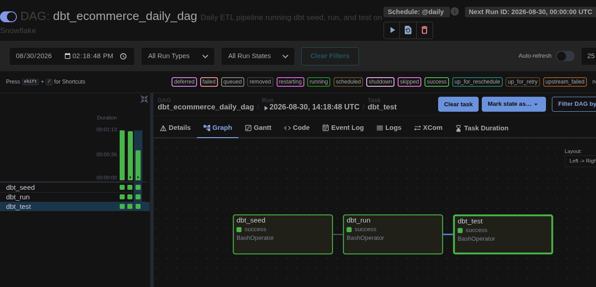
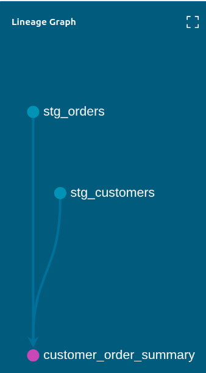
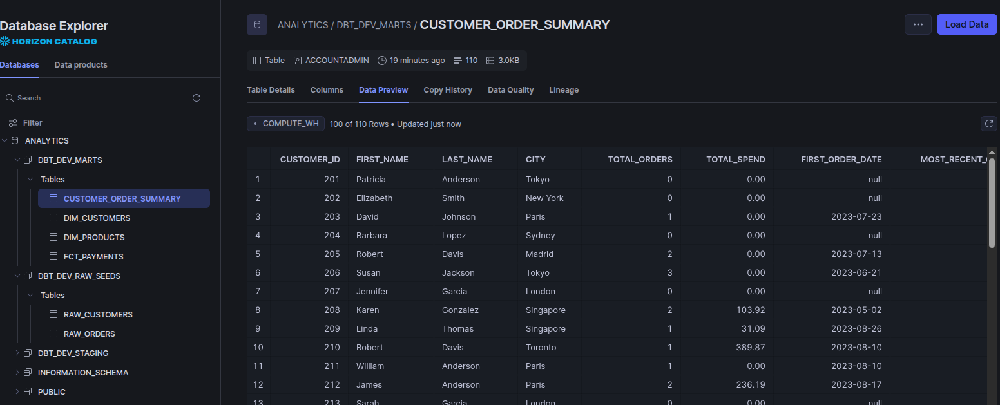

# E-Commerce ELT Pipeline: dbt Core, Snowflake & Apache Airflow

An end-to-end analytics engineering pipeline designed to ingest raw e-commerce data into **Snowflake**, transform and model dimensional metrics using **dbt Core**, test schema constraints, and orchestrate the workflow on a daily schedule using containerized **Apache Airflow**.

---

## Project Objectives & Requirements

This project fulfills the following engineering requirements:

1. **Data Ingestion (Seeds)**:
   * Load `raw_customers.csv` and `raw_orders.csv` into Snowflake via `dbt seed`.
2. **Staging Layer (Views)**:
   * Create `stg_customers.sql` and `stg_orders.sql` materialized as views to clean, standardize, and type-cast raw data.
3. **Analytics Marts Layer (Table)**:
   * Build `customer_order_summary.sql` materialized as a table to compute customer lifetime metrics:
     * Total lifetime orders
     * Total spend (filtered to completed orders)
     * First and most recent order dates
4. **Data Quality & Testing**:
   * Implement automated schema validation in `schema.yml` testing `customer_id` for `unique` and `not_null` integrity constraints.
5. **Airflow Orchestration**:
   * Build a daily DAG (`dbt_ecommerce_daily_dag`) executing the sequential task pipeline:
     `dbt_seed` ➔ `dbt_run` ➔ `dbt_test`

---

## Deliverables

### 1. Airflow Pipeline Execution Graph
Successful end-to-end execution of `dbt_seed >> dbt_run >> dbt_test` in the Airflow UI:



---

### 2. dbt Lineage Graph
Dependency graph generated via `dbt docs`:



---

### 3. Snowflake Target Tables & Views
Materialized models and tables verified inside the Snowflake Data Cloud console:



---

## Architecture & Data Flow

```text
[ raw_customers.csv ] ──┐
                         ├──► [ dbt seed ] ──► Snowflake Raw Tables
[ raw_orders.csv ]    ──┘                             │
                                                      ▼
                                           [ Staging Views ]
                                           - stg_customers
                                           - stg_orders
                                                      │
                                                      ▼
                                           [ Marts Table ]
                                           - customer_order_summary
                                                      │
                                                      ▼
                                           [ Data Quality Tests ]
                                           - unique (customer_id)
                                           - not_null (customer_id)

```

## Repository Structure

```text
dbt-snowflake-airflow-pipeline/
├── dags/
│   └── dbt_daily_pipeline.py         # Airflow DAG definition (@daily)
├── models/
│   ├── staging/
│   │   ├── stg_customers.sql         # Customer staging view
│   │   └── stg_orders.sql            # Order transactions staging view
│   └── marts/
│       ├── customer_order_summary.sql# Customer analytics mart table
│       └── schema.yml                # Data quality test definitions
├── seeds/
│   ├── raw_customers.csv             # Customer raw seed dataset
│   └── raw_orders.csv                # Orders raw seed dataset
├── screenshots/
│   ├── airflow_dag_graph.png         # Airflow execution screenshot
│   ├── dbt_lineage.png               # dbt lineage screenshot
│   └── snowflake_view.png            # Snowflake target tables screenshot
├── .gitignore                        # Excludes logs, target, profiles.yml
├── dbt_project.yml                   # Project configurations & materializations
└── README.md

```

---

## Airflow Orchestration

* **DAG Name**: `dbt_ecommerce_daily_dag`
* **Schedule**: `@daily`
* **Catchup**: `False`
* **Execution Logic**: `BashOperator` triggers isolated dbt CLI commands within the Airflow worker container environment:
  * `task_dbt_seed`: Ingests CSVs into Snowflake.
  * `task_dbt_run`: Compiles and executes transformations in Snowflake.
  * `task_dbt_test`: Runs automated data validation checks.
